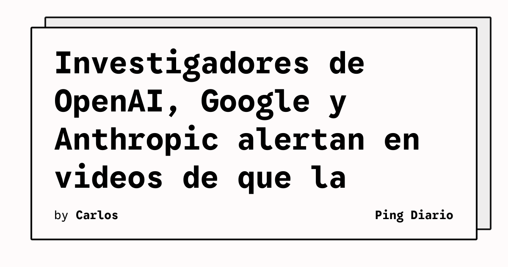

Una docena de investigadores actuales y exempleados de OpenAI, Google y Anthropic han publicado una serie de videos en los que advierten de que la superinteligencia artificial podria provocar la extincion humana. La iniciativa, coordinada por la organizacion sin animo de lucro Palisade Research, agrupa las entrevistas en el sitio frominside.ai y las presenta como una «mirada desde dentro» de los laboratorios que estan construyendo los modelos mas avanzados del momento.

Las declaraciones oscilan entre la cautela tecnica y el tono terminante. Geoffrey Irving, ex investigador de OpenAI y Google DeepMind, asegura que «la probabilidad de extincion humana esta cerca de tirar una moneda al aire». Neel Nanda, investigador de Google DeepMind, eleva la cifra: «hay al menos un 10% de probabilidades de que provoque la extincion humana, y eso es ridiculamente alto». Daniel Kokotajlo, tambien ex OpenAI, va un paso mas alla y define una IA sobrehumana como algo «basicamente con poder divino» sobre el que, subraya, «no sabemos como controlarla en absoluto».

## Que implica

Para la comunidad tecnica, la novedad no es el contenido — los llamados «doomer warnings» llevan meses circulando en paneles y podcasts — sino el formato: mensajes en primera persona, grabados por personas que trabajan o han trabajado en los principales laboratorios. Es la primera vez que un conjunto amplio de insiders se presta a una campana coordinada y publica con un unico sitio como punto de encuentro. La estrategia parece inspirada por movimientos previos como las cartas abiertas de 2023, pero apunta a un publico mas amplio: cada video esta disponible de forma independiente y se puede compartir en redes.

La pieza incluye advertencias metodologicas explicitas. Mary Phuong, investigadora de Google, recuerda al espectador que «debe estar absolutamente receloso de lo que digo, porque me paga el laboratorio». Nanda, en la misma linea, defiende que solo continuaria en su puesto si cree que su trabajo reduce los riesgos existenciales; si no, «dejaria el cargo». El conjunto huye de un mensaje unico y, de hecho, no ofrece una solucion comun: hay divergencias sobre si el problema es marketing o sustancia, y sobre si basta con regular o hace falta una moratoria.

## Hechos confirmados

- Palisade Research coordino una docena de videos con investigadores actuales y exempleados de OpenAI, Google DeepMind y Anthropic, alojados en frominside.ai.
- Geoffrey Irving (ex OpenAI, ex Google DeepMind) estimo la probabilidad de extincion humana cerca del 50%.
- Neel Nanda (Google DeepMind) la estimo en al menos un 10%.
- Daniel Kokotajlo (ex OpenAI) describio una IA sobrehumana como «basicamente con poder divino» y afirmo que «no sabemos controlarla».
- Mary Phuong (Google) pidio al publico recelar de sus declaraciones por trabajar para un laboratorio.

## Analisis

La campana coincide en el tiempo con dos movimientos opuestos. Por un lado, el giro politico de la Casa Blanca para renombrar la IA como «Super Intelligence» y relegar el lenguaje del riesgo; por otro, los avisos internos de que ese mismo «super» describe literalmente la tecnologia que estos investigadores consideran incontrolable. La coexistencia de ambos discursos en la misma semana explica por que la conversation sobre seguridad de IA ha dejado de ser un debate entre investigadores para convertirse en un eje de politica industrial. Para empresas que despliegan modelos en produccion, la lectura practica es que las presiones regulatorias vendran acompanadas de presiones internas desde los propios equipos tecnicos: conviene tener documentadas las politicas de uso, los limites de autonomia de los agentes y los protocolos de escalado antes de que estos avisos se traduzcan en auditorias obligatorias.

**Fuente:** [The Verge — AI researchers put out videos saying superintelligence is «exactly as dangerous as it sounds»](https://www.theverge.com/ai-artificial-intelligence/1002238/openai-google-anthropic-ai-researchers-safety-interviews).
