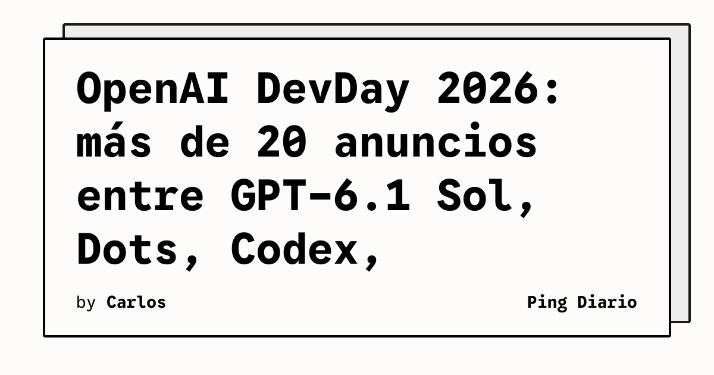

**OpenAI** cerró su **DevDay 2026** con más de **20 anuncios** en una sola jornada, según el recap publicado por la propia compañía. El evento incluyó el lanzamiento de **GPT-6.1 Sol**, la presentación del agente **Dots**, una **Agents API con computer use**, el tier **Ultrafast** para baja latencia, **Codex** corriendo en la nube, y el preview de **Private Intelligence** para empresas con políticas reforzadas de confidencialidad.

OpenAI también anunció un nuevo tier **Pro 500** con 25 veces la cuota de ChatGPT Plus, la apertura de **ChatGPT Space** para trabajo colaborativo entre personas y agentes, y la disponibilidad inicial del sistema operativo de agentes **Bedrock Managed Agents** en alianza con AWS.

## Qué implica

DevDay 2026 consolida la transición de OpenAI de proveedor de modelos a proveedor de plataforma agentiva: cada anuncio refuerza la misma tesis, ejecutar tareas largas en la nube del proveedor con Codex o Dots como motor y un set creciente de herramientas para empresas.

## Hechos confirmados

- El DevDay 2026 superó las **20 novedades principales** según el recap oficial de OpenAI.
- **GPT-6.1 Sol** llega a API, Plus, Pro, Business, Enterprise y Edu, con precios estándar reportados por OpenAI en una quinta parte de Astra.
- **Dots** se ofrece hoy en Pro y Business Premium en mercados elegibles; Enterprise, Edu y Healthcare acceden al beta cuando el admin lo habilita.
- **Ultrafast** ofrece hasta **8x más velocidad** en Codex y hasta **6x** en la API; GPT-6 Astra Ultrafast ya está disponible para Pro 500 y Enterprise, y GPT-6.1 Sol Ultrafast llegará próximamente.
- **Codex** ya puede ejecutarse en la nube desde cualquier dispositivo, con un nuevo Codex CLI por voz y vista `/agents` para delegar trabajo.
- **Code Review** automatizado llega a la app de escritorio de ChatGPT para resumir diffs y dar una primera pasada sobre PRs y MRs en GitHub y GitLab.
- **Codex Security Cloud** analiza repos de GitHub bajo demanda o programada e incluye acceso a modelos de la familia **Daybreak Blue**.
- La **Agents API** añade **computer use** para agentes que interactúan con software, y se integra con Amazon Bedrock como **Bedrock Managed Agents** corriendo sobre AWS.
- **Private Intelligence** introduce **Zero Data Retention con Private Safety Processing**; el preview de **Private Inference** llegará este otoño con confidential computing.
- **Sign in with ChatGPT** ya está disponible globalmente con 16 socios, entre ellos Cognition Devin, Notion, Vercel, T3, OpenClaw y Dactyl.

## Análisis

El DevDay muestra que OpenAI ya no compite solo por benchmarks: la conversación se desplazó a **infraestructura agentiva**, con Codex y Dots como motores y un catálogo creciente de productos enterprise. Para los equipos técnicos, el dato operativo más concreto es que varias de estas funciones se ofrecen por separado del plan Plus; el costo total de un despliegue agentivo en OpenAI empieza a depender más del mix de productos que del precio por token.

**Fuente:** [OpenAI — DevDay 2026 Recap](https://openai.com/index/devday-2026-recap).
