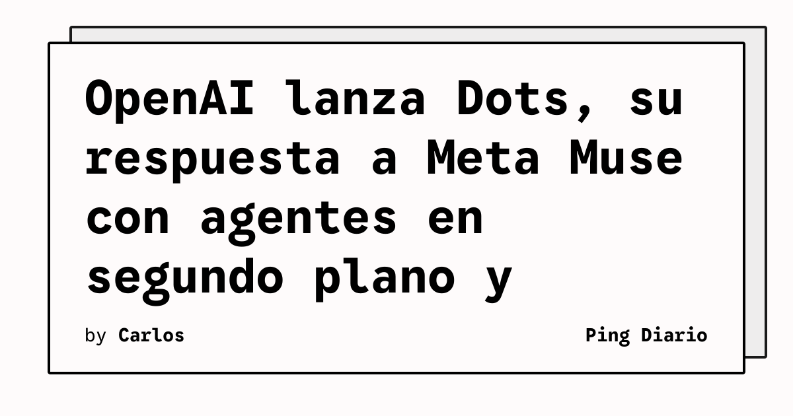

**OpenAI** presentó **Dots** durante el DevDay 2026, su propia versión del asistente con presencia agentiva que **Meta** había adelantado con Muse. Como Muse, los Dots se representan con **avatares simpáticos y personalizables**, según resumió The Verge.

La diferencia con un chatbot tradicional es el modelo de ejecución: Dots trabaja en **segundo plano**, conectado a **aplicaciones** del usuario y ejecutando tareas en una **computadora en la nube**. Con el tiempo, los Dots **aprenden las preferencias** del usuario y ajustan su comportamiento.

## Qué implica

El lanzamiento consolida la idea de que los próximos productos de IA de consumo no serán conversaciones, sino **agentes persistentes** que viven en la nube del proveedor y se conectan a las aplicaciones del usuario. Muse y Dots comparten esa arquitectura, lo que vuelve a poner a Meta y OpenAI en una carrera directa en un frente distinto al de los modelos puros.

## Hechos confirmados

- Dots fue anunciado en el **DevDay 2026** de OpenAI, reportado por The Verge.
- El producto sigue el patrón de **Meta Muse**: avatares personalizables, ejecución de tareas en segundo plano y conexión con apps externas.
- Los Dots corren sobre una **computadora en la nube** gestionada por OpenAI, no en el dispositivo del usuario.
- The Verge describe a Dots como la **respuesta de OpenAI** a Muse, dentro de un patrón creciente de asistentes siempre activos con avatar.

## Análisis

Que OpenAI y Meta converjan en la misma forma de producto sugiere que **el agente persistente con avatar** se está convirtiendo en el formato canónico de la IA de consumo para 2026. El patrón se repite: un asistente con identidad visual propia, ejecución en la nube del proveedor y conexión profunda con las apps del usuario, aprende con el tiempo.

Para los desarrolladores, la pregunta operativa ya no es si construir un chatbot, sino cómo exponer APIs agentivas y conectores a estos asistentes sin perder control sobre los datos. La ejecución en una **computadora en la nube** gestionada por el proveedor implica que el agente puede ver, en principio, todo lo que el usuario ve en sus apps integradas. Cada proveedor resolverá ese dilema a su manera: algunos con sandboxing explícito, otros con políticas de retención y entrenamiento opt-in.

Para los usuarios, el costo de cambiar entre proveedores empieza a medirse en **memoria acumulada y automatizaciones configuradas**, no en precio por token. Cuando el asistente ya aprendió tus preferencias y automatizó flujos en Slack, Gmail y tu calendario, migrar a otro cuesta más que reescribir prompts: cuesta reconfigurar una relación. Esa dinámica es la que vuelve estratégico un lanzamiento como Dots, incluso antes de que OpenAI publique cifras de adopción.

**Fuente:** [The Verge — OpenAI launches Dots, its Muse competitor](https://www.theverge.com/ai-artificial-intelligence/1002033/openai-dots-launch-muse-competitor).
