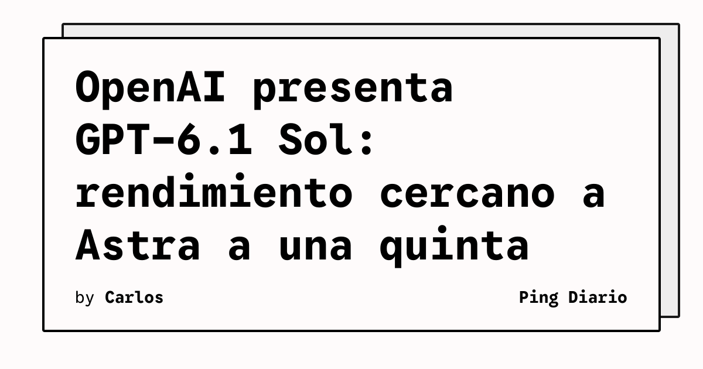

OpenAI presentó hoy **GPT-6.1 Sol**, una actualización de GPT-6 Sol que, según la propia compañía, **se acerca al rendimiento de GPT-6 Astra** en tareas agentivas de programación, uso de computador y trabajo profesional, pero **a una quinta parte del precio de lista** de Astra en tokens de entrada y salida.

El modelo ya está disponible para usuarios Plus, Pro, Business, Enterprise y Edu de **ChatGPT Work** y **Codex**, y también mediante la API de OpenAI bajo el identificador `gpt-6.1-sol`. El precio estándar de la API es de **2 USD por millón de tokens de entrada**, **0,10 USD por millón de tokens con caché** y **10 USD por millón de tokens de salida**. La caché de entrada cuesta 95 % menos que la entrada estándar y 50 % menos que la caché equivalente de GPT-6 Sol.

## Qué implica

GPT-6.1 Sol está pensado para el trabajo diario de desarrolladores y equipos que usan agentes: una categoría donde el costo por tarea importa tanto como la calidad del resultado. Las cifras que destaca OpenAI en sus propios benchmarks muestran márgenes notables.

## Hechos confirmados

- En **DeepSWE v1.1**, GPT-6.1 Sol **empata con GPT-6 Astra** en tareas de ingeniería de software en repos reales, a aproximadamente una quinta parte del costo, y supera a GPT-6 Sol por **6,4 puntos** con menor esfuerzo de razonamiento.
- En **GDP.pdf**, supera a **Opus 5.5** con fallbacks a menos de la mitad del costo por tarea y se acerca al estado del arte de Astra a cerca de una quinta parte del costo.
- En **AutomationBench 1.0.6**, queda **2,2 puntos por encima de Opus 5.5** con razonamiento medio, a aproximadamente un tercio del costo, y sube **4,8 puntos** frente a GPT-6 Sol.
- En **OSWorld 2.0** (computer use), mejora a GPT-6 Sol por **7 puntos** con esfuerzo máximo y queda a **2,1 puntos** de Astra a aproximadamente una séptima parte del costo por tarea.
- En **Terminal-Bench Science 0.1**, más que duplica el puntaje de GPT-6 Sol con esfuerzo máximo, a menos de la mitad del costo: **5,47 USD por tarea** frente a **23,21 USD** de Opus 5.5 y **23,80 USD** de Astra.
- En factualidad, **reduce errores** del 11,4 % al 7,7 % a razonamiento bajo y queda a 1,9 puntos de Astra con menos de un quinto del costo por tarea.

## Análisis

El movimiento profundiza la guerra de precios de los modelos frontera. OpenAI está construyendo un catálogo con tres niveles visibles: **Astra** en el extremo alto, **Sol** como caballo de batalla accesible y, próximamente, **Sol Ultrafast** para escenarios sensibles a latencia. Para los equipos que hoy gastan buena parte de su presupuesto en razonamiento, la diferencia entre pagar 2 USD o 10 USD por millón de tokens de salida cambia la conversación sobre qué tareas delegar a un agente.

**Fuente:** [OpenAI — Introducing GPT-6.1 Sol](https://openai.com/index/introducing-gpt-6-1-sol).
