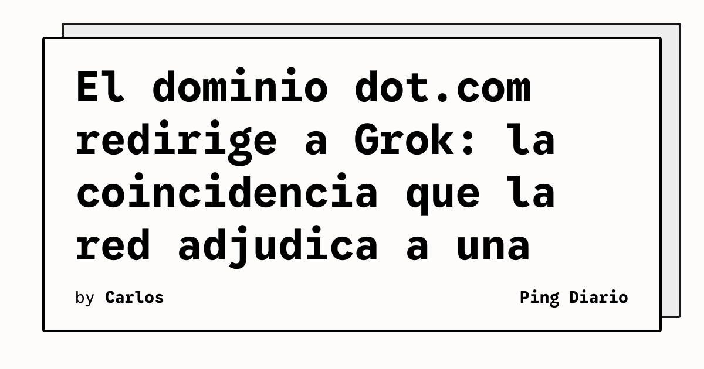

El dominio **dot.com** pertenece a **xAI**, la compañía de Elon Musk, y en estos días **redirige a la página de descarga de la app Grok**, según reporta TechCrunch. La coincidencia con el anuncio de **Dots** por parte de OpenAI —el agente con avatar que la propia OpenAI presentó el mismo día en DevDay 2026— disparó la teoría de que xAI ejecutó una broma deliberada.

TechCrunch señala que el dominio fue **transferido en julio**, según el registro Whois. La nota también aclara que xAI no es dueña del dominio `bot.com` ni de otras variantes obvias como `vot.com`, que aparece en venta, lo que vuelve menos plausible la explicación de una compra defensiva por typosquatting.

## Qué implica

El episodio no es un movimiento de producto, pero ofrece una ventana a la **cultura de trolling recíproco** entre los laboratorios de IA y a la reactividad de la conversación en redes. Para los equipos técnicos, el dato concreto es que un nombre de dominio barato, transferido meses antes, terminó siendo el centro de una lectura competitiva.

## Hechos confirmados

- TechCrunch confirma que **xAI** es la titular del dominio `dot.com` y que este redirige a la página de descarga de **Grok**.
- El dominio fue **transferido en julio de 2026** según el registro Whois citado por TechCrunch.
- El lanzamiento de **Dots** por parte de OpenAI ocurrió el mismo día en que la redirección de `dot.com` se hizo visible.
- TechCrunch aclara que xAI no posee `bot.com` ni otras variantes obvias, lo que descarta parcialmente la hipótesis de compra defensiva.
- El usuario @birdabo en X, autodenominado "chief shitposting officer @SpaceXAI", fue quien primero reportó la coincidencia, según TechCrunch.

## Análisis

La historia importa porque muestra cuánto peso narrativo puede ganar una coincidencia menor en un mercado saturado de lanzamientos. Aunque no hay confirmación oficial de xAI sobre la motivación de la compra, la sincronía ya es parte del archivo público del lanzamiento de Dots: cada vez que alguien relate este anuncio, el episodio del dominio aparecerá asociado. Para los equipos de marca y producto, el recordatorio es que en mercados con saturación mediática, los **detalles periféricos** pueden convertirse en la nota principal antes que el propio anuncio.

**Fuente:** [TechCrunch — The internet is convinced Elon Musk's xAI trolled OpenAI's 'Dots' launch](https://techcrunch.com/2026/09/29/the-internet-is-convinced-elon-musks-xai-trolled-openais-dots-launch/).
