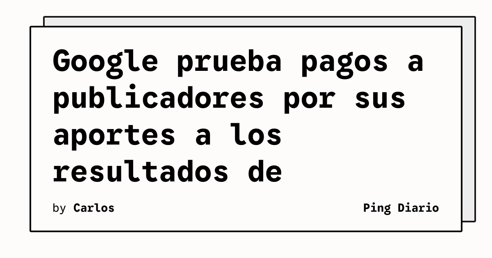

Google está probando un programa que paga a publicadores por la contribución de sus contenidos a las funciones de búsqueda impulsadas por inteligencia artificial. La iniciativa aparece mientras los medios evalúan cómo cambia el tráfico web cuando los usuarios reciben respuestas directamente en los productos de Google.

## Qué implica

The Verge informa que el programa piloto incluye aproximadamente a 100 publicadores. Según los reportes citados por el medio, Google calcula los pagos en función de cuánto contribuye el contenido participante a AI Overviews y AI Mode en Search, además de su chatbot Gemini.

La prueba introduce una posible vía de compensación para los sitios cuyo material se utiliza como parte de respuestas generadas por IA. Hasta ahora, buena parte del debate se había concentrado en si estas funciones reducen las visitas que antes llegaban a las páginas originales desde los resultados tradicionales.

Para los equipos que publican contenido técnico, la cuestión central será medir no solo las visitas, sino también la presencia de sus materiales dentro de respuestas, resúmenes y flujos de consulta asistidos por modelos. La visibilidad podría depender de señales distintas a las del posicionamiento web clásico.

## Hechos confirmados

- El programa piloto de Google incluiría alrededor de 100 publicadores.
- Los pagos estarían vinculados a la contribución de sus contenidos a AI Overviews, AI Mode y Gemini.
- The Verge atribuye parte de la información a reportes de The Information y Digiday.
- El artículo menciona casos de ingresos superiores a un millón de dólares para un publicador participante durante un año y de entre 50.000 y 60.000 dólares para otro durante algunos meses.
- La iniciativa se desarrolla en medio de críticas y litigios relacionados con el impacto de la búsqueda con IA sobre el tráfico editorial.

## Análisis

El programa parece apuntar a un cambio desde el modelo de «atraer clics» hacia otro en el que también importa ser utilizado como insumo de una respuesta. Eso puede abrir una nueva fuente de ingresos, pero también aumenta la dependencia de las reglas de atribución y medición definidas por la plataforma.

Para los medios tecnológicos, será importante conservar datos propios, etiquetar contenidos y entender qué parte de sus materiales aparece en las respuestas generadas. El piloto todavía no demuestra un modelo definitivo: muestra que Google está buscando una forma de repartir valor mientras la búsqueda cambia de página de resultados a interfaz conversacional.

**Fuente:** [The Verge — Google reportedly tests paying publishers for AI search results](https://www.theverge.com/tech/1002665/google-paying-publishers-ai-search-features).
