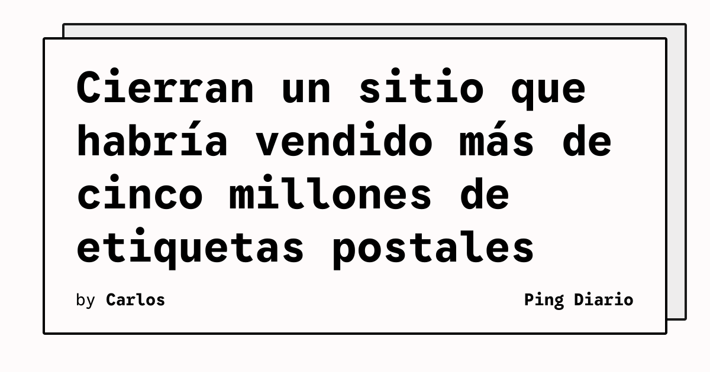

Las autoridades postales de Estados Unidos incautaron el dominio de un sitio web acusado de vender millones de etiquetas de envío falsificadas. El caso muestra cómo un fraude digital puede convertir una plataforma aparentemente simple en una operación de gran escala con impacto financiero directo.

## Qué implica

Según Postal Employee Network, la U.S. Postal Inspection Service y agencias federales asociadas actuaron contra LabelsBank.com. El sitio habría ofrecido etiquetas de USPS a un precio fijo, normalmente de dos dólares, sin considerar el peso, el tamaño ni el destino del paquete.

El modelo aprovechaba una diferencia entre el precio cobrado al comprador y el costo real del servicio postal. Para los usuarios, la plataforma prometía un descuento significativo; para USPS, el resultado habría sido una pérdida acumulada por servicios de transporte prestados con etiquetas no autorizadas.

Desde una perspectiva de seguridad, el caso combina abuso de una marca, fraude de pagos y explotación de la confianza que los usuarios depositan en servicios logísticos digitales. También ilustra que el cierre de un dominio puede formar parte de la respuesta operativa cuando la infraestructura web se utiliza para facilitar una actividad fraudulenta.

## Hechos confirmados

- El sitio intervenido fue identificado como LabelsBank.com.
- Las autoridades indicaron que más de 5.000 clientes habrían comprado más de 5,1 millones de etiquetas.
- La pérdida estimada para USPS supera los 126 millones de dólares.
- El dominio fue incautado y cerrado junto con la presentación de cargos federales.
- Las acusaciones corresponden a un proceso en curso; la persona acusada se presume inocente mientras no exista una condena.

## Análisis

El incidente refuerza la necesidad de validar los servicios digitales que intermedian pagos, envíos o documentos oficiales. Un precio fijo que no depende de variables básicas del servicio debería activar controles antifraude, especialmente cuando la plataforma opera fuera de los canales autorizados.

Para equipos técnicos, la lección no se limita al bloqueo del dominio. También es necesario correlacionar señales de registro, pagos, abuso de marca, patrones de compra y uso anómalo de APIs. La defensa efectiva requiere combinar inteligencia de amenazas, monitoreo transaccional y coordinación con las entidades afectadas.

**Fuente:** [Postal Employee Network — U.S. Postal Inspectors Shut Down Website Selling Millions of Counterfeit Postage Labels](https://postalemployeenetwork.com/news/2026/09/26/u-s-postal-inspectors-shut-down-website-selling-millions-of-counterfeit-postage-labels/).
