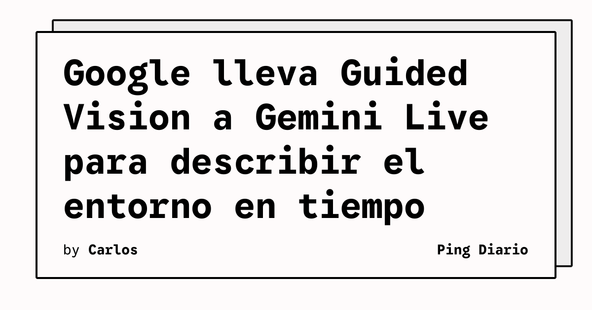

Google está incorporando Guided Vision a Gemini Live para ofrecer descripciones de audio en tiempo real a partir de lo que enfoca la cámara del teléfono. La función está orientada especialmente a personas ciegas o con baja visión, aunque también puede servir en situaciones concretas en las que el usuario necesita interpretar información visual.

## Qué implica

Al compartir la cámara con Gemini Live, el usuario puede pedir que el sistema describa el entorno, lea texto pequeño, identifique objetos o aporte detalles sobre un elemento específico. También puede formular preguntas de seguimiento, por ejemplo para consultar una fecha de vencimiento después de que Gemini haya localizado un producto.

La función se integra con la aplicación Gemini y con Google TalkBack. Además, Google indica que puede configurarse un acceso directo desde los ajustes de accesibilidad en dispositivos con Android 9 o versiones posteriores. El sistema puede emitir indicaciones de audio para ayudar a encuadrar aquello sobre lo que se está preguntando.

La interacción está pensada para ser conversacional: no se limita a entregar una descripción inicial, sino que permite pedir aclaraciones sobre el elemento que aparece en pantalla. Esa capacidad resulta especialmente útil cuando la primera respuesta no contiene el dato concreto que busca el usuario.

## Hechos confirmados

- Guided Vision se lanza en Gemini Live para dispositivos Android compatibles.
- Puede describir escenas, leer textos, identificar objetos y responder preguntas de seguimiento.
- También está disponible mediante Google TalkBack.
- Google advierte que no debe utilizarse para navegación, desplazamientos seguros, detección de obstáculos ni como sustituto de un bastón u otra ayuda de movilidad.

## Análisis

La función ilustra un uso de la visión artificial en el que la utilidad no depende de generar una imagen, sino de convertir información visual en una interacción de audio. Esa diferencia puede reducir barreras en tareas cotidianas y facilitar consultas que antes requerían ayuda externa.

La advertencia de Google es esencial. Una descripción generada por IA puede ser incompleta o equivocada, y el riesgo aumenta cuando la respuesta se utiliza para desplazarse o tomar decisiones de seguridad. El diseño responsable de estas funciones exige separar la asistencia informativa de los sistemas destinados a sustituir ayudas de movilidad certificadas.

En términos de producto, Guided Vision también muestra que la accesibilidad puede beneficiarse de interfaces multimodales sin convertirlas automáticamente en dispositivos médicos. El valor está en ofrecer una capa adicional de contexto, manteniendo claro cuándo el usuario debe confiar en una ayuda especializada o en una persona.

**Fuente:** [The Verge](https://www.theverge.com/ai-artificial-intelligence/1003756/google-gemini-live-guided-vision).
