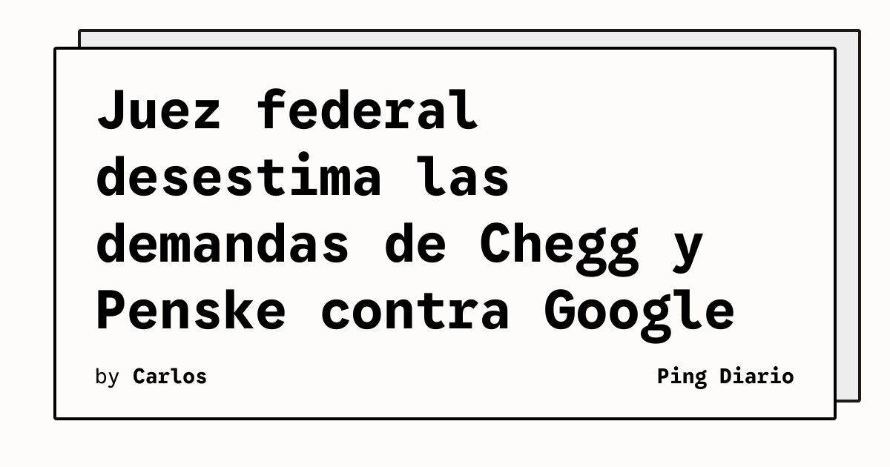

El juez de distrito de EE. UU. **Amit Mehta** desestímó las demandas presentadas por **Chegg** y **Penske Media** contra Google por sus funciones de búsqueda con IA, incluidos los AI Overviews. Las editoras acusaban a Google de prácticas anticompetitivas que estaban destruyendo su tráfico; el juez resolvió que esa conducta no es ilegal bajo la ley antitrust vigente.

## Qué implica

La decisión deja a las editoras sin una vía judicial interna en EE. UU. frente al desplazamiento de tráfico causado por la búsqueda generativa. Para quienes publican contenido indexable, la señal es clara: la protección no vendrá por la vía antitrust americana, al menos sin una ley nueva. La presión regulatoria tiende a migrar a Europa y Reino Unido.

## Hechos confirmados

- La resolución la dictó el juez de distrito de EE. UU. **Amit Mehta**, según Ars Technica.
- Las demandas fueron presentadas en **2025** por **Chegg** y **Penske Media** (editora de Rolling Stone y Variety, entre otras).
- Chegg acusó a Google de **scraping** no autorizado de su contenido educativo para entrenar Gemini.
- Google pidió el archivo de los casos a comienzos de 2026.
- Mehta fue también el juez del caso antimonopolio del DOJ contra Google, donde declaró a Google infractora de la ley.
- Mehta escribió que una «expectativa» de tráfico no equivale a un «acuerdo» contractual.
- Mehta reconoció el daño a periodistas, educadores y creadores, pero sostuvo que la ley antitrust no puede sustituir al legislador.
- Google, según el reportaje, está explorando un programa piloto para **pagar a sitios** cuyo contenido alimenta respuestas de IA, con reception tibia entre las editoras.

## Análisis

Es plausible que el fallo acelere el desplazamiento del debate hacia **Bruselas** y, en menor medida, hacia la **Competition and Markets Authority** del Reino Unido: la Comisión Europea ya examina las mismas prácticas y tiende a aplicar criterios más severos con las grandes plataformas. Para Google, el alivio es táctico, no estructural: la pregunta de fondo —si la búsqueda generativa puede capturar contenido sin compensar a quien lo produce— sigue abierta y se resolverá, casi seguro, en el plano regulatorio y no en el judicial estadounidense.

Para los equipos de producto que dependen de SEO o de tráfico orgánico desde Google, el cálculo cambia: la **diversificación de canales** y el **first-party data** dejan de ser una opción táctica y se vuelven cobertura básica. Los pilotos de pago directo que Google está probando apuntan a un futuro donde el contenido se monetiza por API, no por clic, lo que obliga a repensar también los embudos analíticos y los modelos de atribución.

**Fuente:** [Ars Technica — Judge dismisses Chegg and Penske antitrust lawsuits targeting Google AI search](https://arstechnica.com/google/2026/10/antitrust-lawsuits-targeting-google-ai-search-dismissed-by-federal-judge/).
