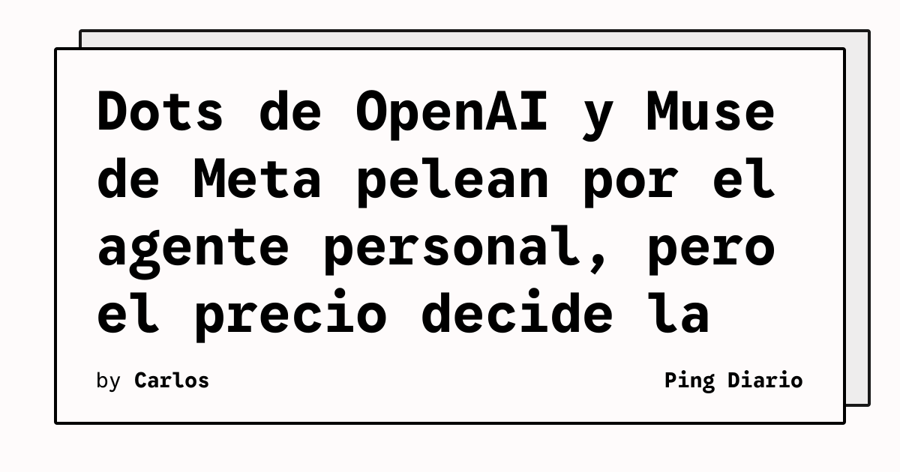

The Verge publicó un seguimiento de la apertura de OpenAI DevDay 2026 donde **Dots**, el nuevo agente personal de OpenAI, queda directamente comparado con **Muse**, la plataforma de agentes de Meta. La conclusión editorial es incómoda para OpenAI: la pelea por el agente personal puede ganarla no el producto más capaz, sino el más barato.

## Qué implica

Que el segmento de «agentes siempre activos» se libere por precio es coherente con lo que ya ocurrió con ChatGPT frente a los chatbots previos: la distribución se masifica cuando la fricción de entrada se acerca a cero. Si Meta logra mantener Muse **gratuito** y embebido en sus redes sociales, la batalla por el usuario casual se vuelve cuesta arriba para un Dots restringido al plan Pro de US$100 mensuales.

## Hechos confirmados

- Dots fue presentado por Sam Altman durante OpenAI DevDay 2026, según The Verge.
- El producto está impulsado por **GPT-6 Astra**, según la propia presentación.
- Dots se ofrece, en esta etapa, únicamente a usuarios del plan **ChatGPT Pro de US$100 mensuales** o superior.
- Muse, según The Verge, ofrece una máquina virtual dedicada gratuita para alojar el agente y los datos del usuario.
- Meta no cobra extra por Muse a quien ya tenga una cuenta de Facebook/Instagram/WhatsApp.
- OpenAI reportó, según Axios, cerca de **US$70 mil millones de ARR** y un crecimiento del 70 % desde el inicio del tercer trimestre, y proyecta **US$280 mil millones de gasto** hasta 2030 según el FT.
- OpenAI dijo estar negociando, según Bloomberg, una ronda de **US$30 mil millones** a una valoración de **US$1,4 billones**.
- ChatGPT cuenta con unos **1.200 millones de usuarios** según datos citados por The Verge.
- Ejecutivos de OpenAI presentaron un marco de privacidad llamado **«OpenAI Private Intelligence»** con opción de cero retención de datos.

## Análisis

La forma que adopte este mercado importa más que cualquier demo: si el segmento se define como **infraestructura de productividad personal**, Dots tiene terreno; si se define como **presencia social persistente**, Muse parte con ventaja porque el coste marginal para Meta es casi nulo y el coste para OpenAI es elevado. Que la propia ejecutiva de OpenAI haya tenido que justificar el precio en la rueda de prensa posterior al keynote sugiere que la compañía lo sabe.

Para los equipos técnicos, dos detalles prácticos del reportaje importan más que la narrativa: la promesa de **tareas largas** y multimodalidad (texto, voz y teléfono), y la integración pendiente con **Microsoft Agent 365**. Si la ejecución cumple, OpenAI puede recortar distancia en el segmento enterprise, donde Anthropic ha dominado durante años; si no, la conversación volverá rápidamente al precio.

**Fuente:** [The Verge — OpenAI's new agent is a shot at Meta — but can it compete with free?](https://www.theverge.com/ai-artificial-intelligence/1003399/meta-openai-ai-agents-muse-dots-battle).
