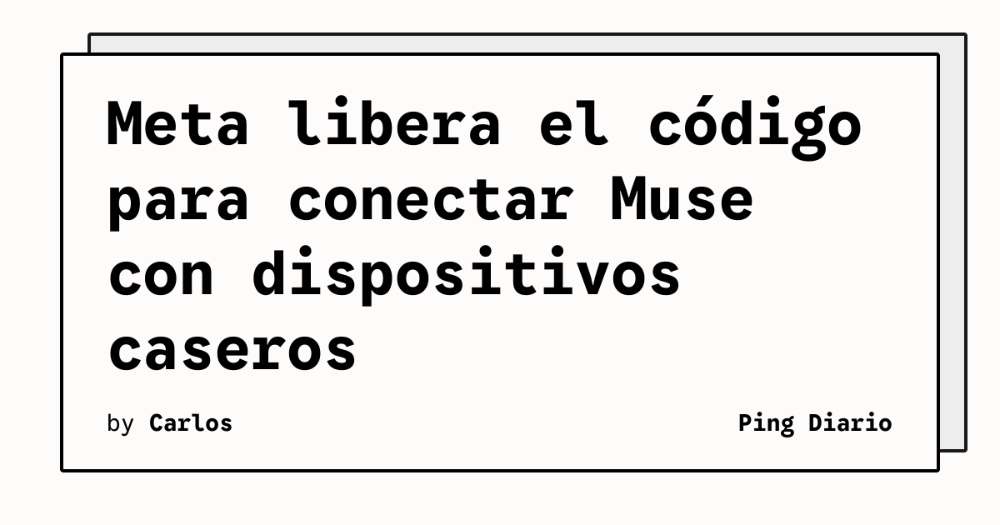

Meta abrió el código necesario para construir dispositivos propios que utilicen Muse, su nuevo agente de inteligencia artificial. La propuesta permite conectar el sistema con pantallas, botones, sensores y actuadores mediante placas ESP32, Raspberry Pi y otros componentes disponibles en el mercado.

La compañía plantea varios usos: mostrar recordatorios en una pantalla de tinta electrónica, incorporar Muse a un dispositivo conectado por HDMI o crear interfaces táctiles pequeñas. La idea es trasladar el agente desde una aplicación cerrada hacia prototipos físicos que respondan a eventos del entorno.

## Qué implica

El SDK publicado por Meta amplía el espacio de experimentación alrededor de Muse. Un desarrollador puede conectar el agente con una pantalla o con dispositivos de automatización sin tener que construir desde cero toda la integración de hardware.

Meta también mostró un dispositivo llamado Muse Home Link, que puede ejecutar habilidades creadas por la comunidad. Según la empresa, esas habilidades podrían encender una luz, controlar un televisor o enviar un documento a una impresora, dependiendo de la configuración del usuario.

El proyecto no elimina las dificultades habituales de un agente conectado al mundo físico. La propia Meta advierte que los usuarios avanzan bajo su propia responsabilidad, una precaución relevante cuando el software puede accionar dispositivos reales.

## Hechos confirmados

- Meta publicó código del SDK para construir dispositivos compatibles con Muse.
- El SDK permite trabajar con placas ESP32 y Raspberry Pi, además de pantallas, botones, sensores y actuadores.
- La empresa sugirió usos con pantallas de tinta electrónica, dispositivos HDMI y pequeñas pantallas táctiles.
- Meta fabricó 5.000 unidades del dispositivo Muse Home Link y abrió una lista de espera.
- La compañía advirtió a los usuarios que procedan bajo su propia responsabilidad.

## Análisis

La apertura del SDK convierte a Muse en una plataforma experimental, no solo en una función dentro de un producto de Meta. Eso puede acelerar prototipos y permitir que la comunidad descubra interfaces que la empresa no habría priorizado internamente.

El desafío será controlar permisos y efectos secundarios. Un agente que puede enviar documentos o controlar dispositivos necesita límites claros, registro de acciones y una forma sencilla de revocar habilidades. La combinación de hardware barato y agentes capaces puede ser atractiva para desarrolladores, pero también exige tratar cada integración como una superficie operativa con consecuencias físicas.

**Fuente:** [The Verge](https://www.theverge.com/tech/1004330/meta-muse-ai-gadgets-home-link).
